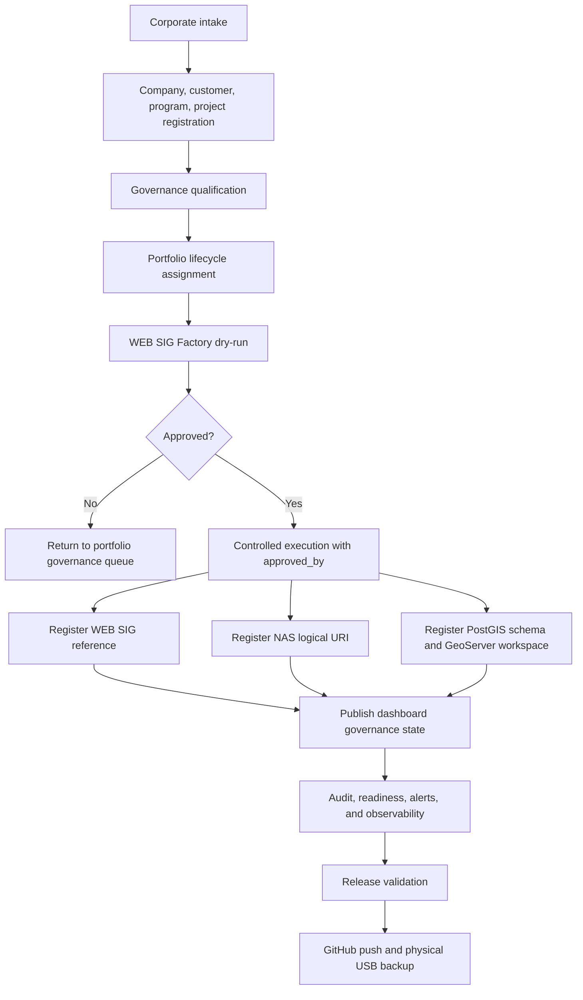

# Corporate Control Tower Operational Flow

## Purpose

Define the enterprise operating flow for Corporate Control Tower REV12/REV13.
The Tower is the BIMSIG corporate governance layer. It receives corporate
intent, validates governance, provisions controlled references, publishes
executive visibility, audits decisions, and protects continuity.

The Tower does not operate project production. WEB SIG SUITE, BIMSIG Field,
PostGIS, GeoServer, NAS, Google Workspace, and project teams keep their own
operational boundaries.

## ADR Traceability

| Area | Governing ADR |
| --- | --- |
| REV11/REV13 baseline | ADR-0001, ADR-0024 |
| Multitenancy | ADR-0014 |
| Tower vs WEB SIG boundary | ADR-0015 |
| Provisioning | ADR-0017, ADR-0026 |
| NAS information center | ADR-0007, ADR-0019 |
| PostGIS and GeoServer governance | ADR-0008, ADR-0009, ADR-0023 |
| Portfolio domain | ADR-0025 |
| DevSecOps, release, backup | ADR-0012, ADR-0021 |
| Permanent architecture rule | ADR-0022 |

## Operating Principles

1. Every project-related action is scoped by `company_id`.
2. The Tower stores governance state, metadata, references, and audit trails.
3. The Tower never stores project binary assets in the database.
4. WEB SIG provisioning requires dry-run before controlled execution.
5. Controlled execution requires `approved_by`.
6. Dashboard publication is based on registered references, not project
   operation.
7. Every operational decision must be traceable to an ADR and a persisted audit
   event.
8. Every workday ends with GitHub synchronization and physical USB backup.

## Enterprise Roles

| Role | Responsibility |
| --- | --- |
| Corporate Administrator | Maintains companies, users, roles, licenses, and global governance. |
| Portfolio Manager | Qualifies clients, programs, projects, lifecycle, and approval gates. |
| Provisioning Operator | Runs dry-runs and controlled WEB SIG Factory execution. |
| GIS Administrator | Governs PostGIS schemas, GeoServer workspaces, datastores, layers, WMS, and WFS references. |
| NAS Information Manager | Governs document metadata, logical NAS URI, versioning, and retention. |
| Security Officer | Reviews role assignments, authorization, audit, and SSO readiness. |
| Executive Viewer | Consumes portfolio dashboard, KPIs, risks, alerts, and comparative views. |
| DevSecOps Maintainer | Runs CI/CD, release checks, monitoring, Docker readiness, GitHub push, and backups. |

## End-to-End Flow

## Phase 1: Corporate Intake

Purpose: capture corporate intent before any project provisioning.

Inputs:

- Company identity.
- Customer identity.
- Program identity.
- Project identity.
- Initial lifecycle stage.
- Required WEB SIG, NAS, GIS, PostGIS, GeoServer, and Google Workspace
  references.

Expected system behavior:

- Register enterprise entities through the Corporate Portfolio Domain.
- Preserve `company_id` scope for every project.
- Avoid direct WEB SIG operation.

Primary APIs:

- `POST /api/v1/companies`
- `POST /api/v1/companies/{company_id}/customers`
- `POST /api/v1/companies/{company_id}/programs`
- `POST /api/v1/companies/{company_id}/projects`

Exit criteria:

- Company exists.
- Project exists under the company.
- Lifecycle stage is explicit.
- Audit trail records the registration.

## Phase 2: Governance Qualification

Purpose: decide whether a project is ready for controlled provisioning.

Checks:

- Company is active.
- Project is active or approved for provisioning.
- Required roles and licenses are available.
- NAS and GIS governance targets are known.
- WEB SIG Factory template is selected.
- Architecture boundary is respected.

Exit criteria:

- Project is eligible for dry-run.
- Missing governance data is visible to the Portfolio Manager.

## Phase 3: WEB SIG Factory Dry-Run

Purpose: simulate the provisioning plan without side effects.

Primary API:

- `POST /api/v1/companies/{company_id}/websig-factory/dry-run`

Required payload sections:

- `company`
- `project`
- `factory_blueprint`

Expected result:

- Planned steps for WEB SIG, PostGIS, NAS, documents, GeoServer, dashboard, and
  catalogs.
- No persisted infrastructure side effects.
- Plan is ready for approval review.

Exit criteria:

- Dry-run is reviewed.
- Risks, missing metadata, or blocked integrations are resolved.

## Phase 4: Approval Gate

Purpose: prevent uncontrolled creation of WEB SIG references.

Required control:

- `approved_by` must be present for controlled execution.

Governance evidence:

- Approver identity.
- Factory template.
- WEB SIG slug and URL.
- NAS logical URI.
- PostGIS schema.
- GeoServer workspace.
- Enabled modules.

Exit criteria:

- Portfolio Manager or authorized approver approves execution.
- Approval becomes part of the provisioning request.

## Phase 5: Controlled Provisioning Execution

Purpose: execute the approved WEB SIG Factory workflow and register governed
references.

Primary API:

- `POST /api/v1/companies/{company_id}/websig-factory/execute`

Expected state changes:

- Provisioning request status becomes `provisioned`.
- `execution_mode` becomes `controlled`.
- `approved_by` is persisted.
- Project references are updated:
  - `websig_instance_id`
  - `websig_url`
  - `nas_root_uri`
  - `gis_binding_id`
  - `lifecycle_stage`

Exit criteria:

- WEB SIG reference is registered.
- NAS root reference is registered.
- GIS binding reference is registered.
- Dashboard can report governed readiness.

## Phase 6: NAS Information Center Registration

Purpose: establish corporate information references for project assets.

Governed data:

- Logical NAS URI.
- Category.
- Metadata.
- Document status.
- Checksum.
- Version history.
- Audit events.

Primary APIs:

- `POST /api/v1/companies/{company_id}/projects/{project_id}/nas/assets`
- `GET /api/v1/companies/{company_id}/projects/{project_id}/nas/assets`

Exit criteria:

- NAS references exist without database binary storage.
- Document state is auditable.

## Phase 7: Corporate GIS Registration

Purpose: govern PostGIS and GeoServer infrastructure references.

Governed data:

- PostGIS schema.
- GeoServer workspace.
- Datastores.
- Layers.
- WMS references.
- WFS references.
- Validation status.

Primary APIs:

- `POST /api/v1/companies/{company_id}/projects/{project_id}/gis/bindings`
- `GET /api/v1/companies/{company_id}/projects/{project_id}/gis/resources`

Exit criteria:

- GIS reference exists for executive governance.
- The Tower does not publish or edit project GIS operations.

## Phase 8: Executive Dashboard Publication

Purpose: expose consolidated corporate state to executives and governance
roles.

Primary API:

- `GET /api/v1/companies/{company_id}/dashboard/executive`

Dashboard signals:

- Portfolio count.
- Lifecycle count.
- WEB SIG governed count.
- NAS governed count.
- GIS linked count.
- WEB SIG coverage.
- Radar contacts.
- Risks.
- Portfolio governance rows.
- Comparatives between projects.

Exit criteria:

- Project appears in executive dashboard.
- WEB SIG, NAS, and GIS show `registrado` when references exist.
- The dashboard consumes consolidated data only.

## Phase 9: Audit, Monitoring, and Readiness

Purpose: keep an enterprise evidence trail and operational readiness.

Signals:

- Audit events.
- Provisioning status.
- Operational health.
- Release readiness.
- Observability baseline.

Primary APIs:

- `GET /health`
- `GET /api/v1/operational/health`
- `GET /api/v1/operational/readiness`
- `GET /api/v1/audit/events`

Exit criteria:

- Health is `ok`.
- Readiness is `ready` before release.
- Audit trail can reconstruct decisions.

## Phase 10: Release and Continuity

Purpose: protect work and make releases repeatable.

Required sequence:

1. Run architecture validation.
2. Run linting.
3. Export OpenAPI.
4. Run tests.
5. Run Docker build when available.
6. Commit and push to GitHub.
7. Create physical USB backup.
8. Verify checksum.

Primary documents:

- `docs/operations/architecture-verification-checklist.md`
- `docs/operations/devsecops-release-checklist.md`
- `docs/operations/daily-usb-backup.md`

Exit criteria:

- GitHub contains the latest code.
- USB contains a verified ZIP and SHA256 file.
- Local service returns `/health` after any controlled restart.

## Operational State Model

| State | Meaning | Next Action |
| --- | --- | --- |
| `intake` | Corporate data received but not qualified. | Complete company, customer, program, and project data. |
| `qualified` | Governance checks passed. | Run WEB SIG Factory dry-run. |
| `planned` | Dry-run exists. | Review and approve. |
| `approved` | Authorized approver accepted plan. | Execute controlled provisioning. |
| `provisioned` | WEB SIG, NAS, and GIS references are registered. | Publish dashboard and monitor. |
| `observed` | Dashboard, audit, and readiness signals are active. | Release and backup. |
| `archived` | Project references are retained for history. | Preserve audit and metadata. |

## Controlled Execution Checklist

Use this checklist before every WEB SIG Factory execution:

1. Confirm `company_id`.
2. Confirm project belongs to the company.
3. Confirm dry-run was reviewed.
4. Confirm `factory_blueprint.template_id`.
5. Confirm `factory_blueprint.websig_slug`.
6. Confirm `factory_blueprint.nas_root_uri`.
7. Confirm `factory_blueprint.postgis_schema_name`.
8. Confirm `factory_blueprint.geoserver_workspace`.
9. Confirm `approved_by`.
10. Confirm dashboard after execution.
11. Confirm provisioning request status.
12. Confirm USB backup at end of day.

## Boundary Rules

The operational flow must not:

- Create an independent WEB SIG application inside this repository.
- Store binary NAS files in the database.
- Operate project production, field work, or project GIS editing.
- Bypass `approved_by` for controlled execution.
- Register project data without company scope.
- Skip ADR, backlog, OpenAPI, tests, GitHub, or backup for release work.

## Current Confirmed Operational Reference

The current controlled test registered `Proyecto Suiza` under `CRTG` with:

- `websig_instance_id`: `WEB-CRTG-PSZ-2026`
- `websig_url`: `https://websig.example.com/crtg/psz-2026`
- `nas_root_uri`: `nas://CRTG/PSZ-2026/websig/root`
- `gis_binding_id`: `GBD-CRTG-PSZ-2026`
- `lifecycle_stage`: `execution`
- `approved_by`: `portfolio-manager`

This confirms the operational path from controlled WEB SIG Factory execution to
executive dashboard publication.
